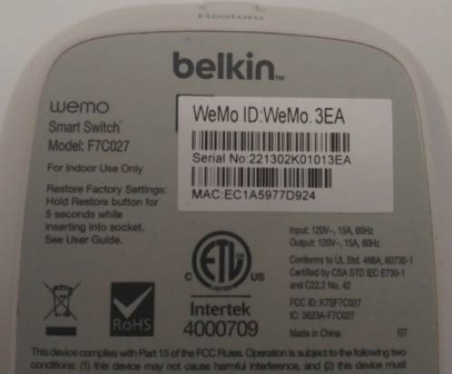

# OCR Image Scan Demo
## Description
WHAT DOES THE APPLICATION DO?

- Allow user to upload an image of a device's MAC ID & Serial Number. 
- Return details as text
```
{
  "mac": ["EC1A5977D924"],
  "serialNo": ["221302K01013EA"],
  "path": "public/image_scan/b4955ed627b3f815fbcfd9785389974d",
  "text": "die .\n/ belkin.\nfwemo [ oo ID:WeMo 3EA\nLR 2\nSerial No 221302K01013EA foy\n0 00 ik\nMAC EC1A5977D924 i\n"
}
```
> From image:


WHAT IS THE GOAL?

1. ✓ Demonstrate the implementation of NestJS server
1. ✓ Demonstrate the implementation of OCR [tesseract.js](https://github.com/naptha/tesseract.js) plugin
1. ✓ Demonstrate the implementation of controllers, modules, and services
1. ✓ Demonstrate the implementation of functional REST API 
1. ✓ Demonstrate the implementation usage of Makefile
1. ✓ Demonstrate the implementation usage of Docker container

## Getting Started
> Running locally in Docker
```
$ git clone <repo>
$ cd <repo>
$ make app-docker-build
$ make app-docker-up
$ make app-docker-remove
```
> Running locally as developer
```
$ git clone <repo>
$ cd <repo>
$ make app-init
$ make app-build
$ make app-serve
```

> NOTE: Steps can be manually done by copying commands located in [Makefile](./Makefile)

## Documentation
Running documentation command will init the web server.
```
$ make app-documentation
```
> Add test coverage documentation by running the command below.
```
$ make app-test
```
## View Application
- Angular: http://localhost:10200/a/angular
- Depth Chart: http://localhost:10200/a/dept-chart.svg

- Documentation: http://localhost:10200/a/doc

- React: http://localhost:10200/a/react
- Test Coverage: http://localhost:10200/a/coverage/


## Frameworks / Tools
- [Angular](https://angular.io/)
- [compodoc](https://compodoc.app/)
- [Docker](https://www.docker.com/)
- [NestJS](https://nestjs.com/)
- [NodeJS](https://nodejs.org/en/)
- [Postman](https://www.postman.com/)
- [React](https://reactjs.org/)
- [tesseract.js](https://github.com/naptha/tesseract.js)
## Demo Image
- Use [example image](./image/mac1.png) to view OCR image scan functionality.